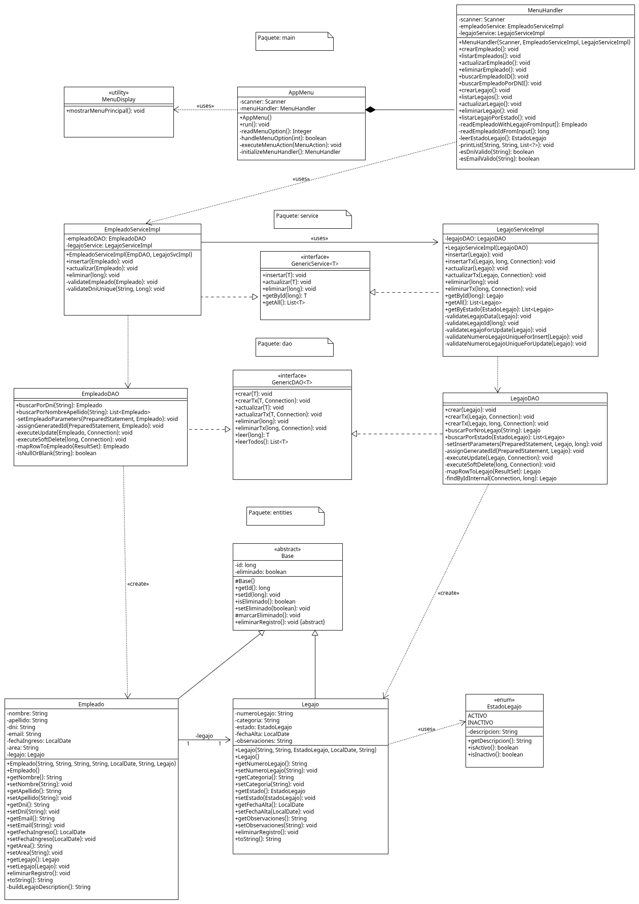

# TFI_Programacion2_Grupo10

**Trabajo Final Integrador de Programación 2 - UTN**

---

## Integrantes del Equipo

| Nombre y Apellido        | Email de Contacto                                                           | Comisión |
| ------------------------ | --------------------------------------------------------------------------- | -------- |
| Agustín Sotelo Carmelich | [agustinemiliano22@gmail.com](mailto:agustinemiliano22@gmail.com)           | 10       |
| Bruno Giuliano Vapore    | [brunogvapore@gmail.com](mailto:brunogvapore@gmail.com)                     | 10       |
| Diego Alejandro Velardes | [velardesdiego@gmail.com](mailto:velardesdiego@gmail.com)                   | 3        |
| Santiago Octavio Varela  | [santiago.varela@tupad.utn.edu.ar](mailto:santiago.varela@tupad.utn.edu.ar) | 14       |

---

## Estructura del Proyecto

```
📦 TFI_Programacion2_Grupo10
 ┣ 📂 src/
 ┃ ┣ 📂 config/                # Conexión a la base de datos (DatabaseConnection)
 ┃ ┣ 📂 entities/              # Clases Empleado y Legajo
 ┃ ┣ 📂 dao/                   # Interfaces genéricas y DAOs concretos (EmpleadoDao, LegajoDao)
 ┃ ┣ 📂 service/               # Lógica de negocio y manejo de transacciones
 ┃ ┗ 📂 main/                  # Clase principal y menú de consola (AppMenu)
 ┣ 📂 sql/
 ┃ ┣ create_database.sql       # Script de creación de la base y tablas
 ┃ ┗ insert_data.sql           # Script con datos de prueba
 ┣ 📂 lib/                     # Librerías externas (.jar) agregadas al proyecto desde NetBeans
 ┣ 📂 img/                     # Diagramas y recursos visuales
 ┃ ┗ 📄 UML_Empleado_Legajo.png # Imagen del Diagrama UML del dominio Empleado-Legajo
 ┣ 📂 docs/                    
 ┃ ┣ 📄 Informe_TFI_Grupo10.pdf   # Informe final con análisis y conclusiones
 ┃ ┗ 📄 Diagrama_TFI_Grupo10.uxf   # Diagrama UML para importar en UMLetino
 ┣ 📄 config.properties         # Configuración de conexión MySQL (usuario, contraseña, URL)
 ┣ 📄 .gitignore                # Exclusiones de archivos y carpetas
 ┗ 📄 README.md                 # Archivo actual
```

---

## 1. Descripción del Dominio Elegido

Se seleccionó el dominio **Empleado (A) → Legajo (B)** por su aplicabilidad para cumplir con todos los objetivos técnicos y de negocio establecidos en el Trabajo Final Integrador.

### Justificación de la Elección

El requisito principal del trabajo es modelar una **asociación unidireccional 1 a 1**, y el dominio `Empleado → Legajo` representa este escenario de forma natural en un sistema de gestión de personal. Un *Empleado* posee un único *Legajo* en su expediente, y un *Legajo* pertenece exclusivamente a un *Empleado*.

Esta correlación directa permite implementar la restricción 1 a 1 en la base de datos mediante una clave foránea única (UNIQUE FOREIGN KEY) en la tabla legajo (específicamente, la columna empleado_id), apuntando a empleado. Esto garantiza que cada empleado tenga un solo legajo y viceversa.

Además, el dominio permite aplicar de manera práctica el uso de **transacciones (commit/rollback)**. El alta de un empleado constituye un caso ideal para demostrar la atomicidad: la creación de un *Empleado* (entidad A) requiere la creación simultánea de su *Legajo* (entidad B). Si alguna de las inserciones falla (por ejemplo, por violar una restricción `UNIQUE` en `nro_legajo`), toda la operación debe revertirse, asegurando la integridad del sistema.

### Reglas de Negocio y Validaciones

El sistema se apoya en un conjunto de validaciones que garantizan la consistencia de los datos y la correcta gestión del personal:

* **Validación de Unicidad:**

  * `dni` (Empleado)
  * `email` (Empleado)
  * `nro_legajo` (Legajo)

* **Validación de Formato:**

  * Campo `email` con estructura estándar (ejemplo: [usuario@dominio.com](mailto:usuario@dominio.com))

* **Manejo de Tipos de Datos:**

  * Fechas (`fechaIngreso`, `fechaAlta`) gestionadas con `java.time.LocalDate`
  * Campo `estado` del legajo como `ENUM('ACTIVO','INACTIVO')`

* **Borrado Lógico:**

  * Campo `eliminado` para ocultar registros sin perder trazabilidad.

* **Relación 1→1 y Borrado en Cascada:**

  * Cada `Empleado` tiene un único `Legajo`.
  * Si un `Empleado` se elimina, su `Legajo` asociado también se borra (`ON DELETE CASCADE`).

### Unidireccionalidad del Modelo

El flujo de negocio está pensado en sentido único: *dado un empleado, obtener su legajo*.
Esto justifica una asociación unidireccional donde la entidad `Empleado` conoce a `Legajo`, pero no a la inversa, cumpliendo con la consigna del TFI.

---

## 2. Requisitos y Pasos para Crear la Base de Datos

### Requisitos Técnicos

* **Java JDK 21 o superior**
* **MySQL 8.0 o superior**
* **DBeaver o cliente SQL compatible**
* **Apache NetBeans IDE 19 o superior**
* **Conector JDBC MySQL (`mysql-connector-j-9.5.0.jar`)**

---

---

## 3. Importación del Proyecto en Apache NetBeans

Dado que los archivos del entorno (`nbproject/`, `build.xml`, etc.) no se incluyen en el repositorio por buenas prácticas de versionado, se debe importar el código fuente existente en NetBeans de la siguiente manera:

1. Abrir **Apache NetBeans**.  
2. Ir a **File → New Project...**  
3. Seleccionar **Java with Ant → Java Project with Existing Sources** y presionar **Next**.  
4. Asignar el nombre del proyecto (por ejemplo, `TFI_Programacion2_Grupo10`).  
5. En **Source Package Folders**, seleccionar la carpeta `src/` del repositorio clonado.  
6. En **Project Folder**, elegir la ubicación donde se guardará el proyecto.  
7. Presionar **Finish**.  
8. Una vez creado el proyecto, en el panel izquierdo hacer **clic derecho sobre “Libraries” → Add JAR/Folder...**  
9. Seleccionar el archivo **`mysql-connector-j-8.4.0.jar`** ubicado dentro de la carpeta `/lib/` del repositorio.  
10. Confirmar con **Open** y verificar que el JAR aparezca en la lista de librerías del proyecto.  
11. Luego, abrir el archivo **`config.properties`** (ubicado en la carpeta `src/config/` o en la raíz del proyecto) y completar las credenciales de conexión a MySQL:

    ```properties
    db.url=jdbc:mysql://localhost:3306/tpi_prog2_empleados
    db.user=root
    db.password=tu_contraseña
    db.driver=com.mysql.cj.jdbc.Driver
    ```

    ⚠️ *Es importante reemplazar `tu_contraseña` por la clave real del usuario `root` en tu instalación local de MySQL.*

Con esto, NetBeans generará automáticamente los archivos de configuración locales (`nbproject/`, `build.xml`, etc.), agregará el conector JDBC y establecerá los parámetros de conexión a la base de datos.  
El proyecto quedará listo para compilar y ejecutar correctamente desde el IDE.

---


### Creación de la Base de Datos

1. Abrir **DBeaver** y conectarse a MySQL como usuario `root`.

2. Ejecutar el script `create_database.sql` ubicado en la carpeta `/sql/`:

   ```sql
   SOURCE sql/create_database.sql;
   ```

   Esto creará la base de datos `tpi_prog2_empleados` junto con las tablas `empleado` y `legajo`.

3. Ejecutar el script `insert_data.sql`:

   ```sql
   SOURCE sql/insert_data.sql;
   ```

   Esto insertará datos de prueba coherentes con el dominio `Empleado → Legajo`.

4. Verificar la correcta creación de los registros con:

   ```sql
   SELECT * FROM empleado;
   SELECT * FROM legajo;
   ```

---

## 📊 Diagrama UML

El siguiente diagrama UML representa la relación 1→1 entre las clases **Empleado (A)** y **Legajo (B)**, junto con sus principales atributos y la dirección de la asociación. 


